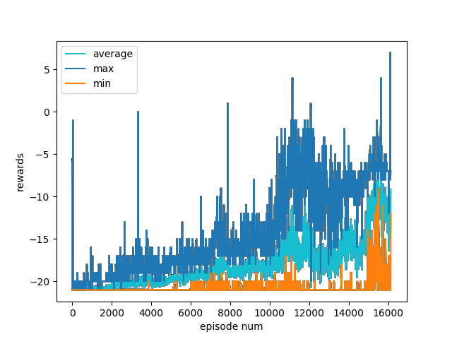

# Evolution Strategies

This is a PyTorch implementation of [Evolution Strategies](https://arxiv.org/abs/1703.03864).

# Requirements

Python 3.5, PyTorch >= 0.2.0, numpy, gym, universe, cv2

# What is this? (For non-ML people)

A large class of problems in AI can be described as "Markov Decision Processes," in which there is an agent taking actions in an environment, and receiving reward, with the goal being to maximize reward. This is a very general framework, which can be applied to many tasks, from learning how to play video games to robotic control. For the past few decades, most people used Reinforcement Learning -- that is, learning from trial and error -- to solve these problems. In particular, there was an extension of the backpropagation algorithm from Supervised Learning, called the Policy Gradient, which could train neural networks to solve these problems. Recently, OpenAI had shown that black-box optimization of neural network parameters (that is, not using the Policy Gradient or even Reinforcement Learning) can achieve similar results to state of the art Reinforcement Learning algorithms, and can be parallelized much more efficiently. This repo is an implementation of that black-box optimization algorithm.

# Usage

There are two neural networks provided in `model.py`, a small neural network meant for simple tasks with discrete observations and actions, and a larger Convnet-LSTM meant for Atari games.

Run `python3 main.py --help` to see all of the options and hyperparameters available to you.

Typical usage would be:

```
python3 main.py --small-net --env-name CartPole-v1
```
which will run the small network on CartPole, printing performance on every training batch. Default hyperparameters should be able to solve CartPole fairly quickly.

```
python3 main.py --small-net --env-name CartPole-v1 --test --restore path_to_checkpoint
```
which will render the environment and the performance of the agent saved in the checkpoint. Checkpoints are saved once per gradient update in training, always overwriting the old file.

```
python3 main.py --env-name PongDeterministic-v4 --n 10 --lr 0.01 --useAdam
```
which will train on Pong and produce a learning curve similar to this one:



This graph was produced after approximately 24 hours of training on a 12-core computer. I would expect that a more thorough hyperparameter search, and more importantly a larger batch size, would allow the network to solve the environment.

# Deviations from the paper

* I have not yet tried virtual batch normalization, but instead use the selu nonlinearity, which serves the same purpose but at a significantly reduced computational overhead. ES appears to be training on Pong quite well even with relatively small batch sizes and selu.

* I did not pass rewards between workers, but rather sent them all to one master worker which took a gradient step and sent the new models back to the workers. If you have more cores than your batch size, OpenAI's method is probably more efficient, but if your batch size is larger than the number of cores, I think my method would be better.

* I do not adaptively change the max episode length as is recommended in the paper, although it is provided as an option. The reasoning being that doing so is most helpful when you are running many cores in parallel, whereas I was using at most 12. Moreover, capping the episode length can severely cripple the performance of the algorithm if reward is correlated with episode length, as we cannot learn from highly-performing perturbations until most of the workers catch up (and they might not for a long time).

# Tips

* If you increase the batch size, `n`, you should increase the learning rate as well.

* Feel free to stop training when you see that the unperturbed model is consistently solving the environment, even if the perturbed models are not.

* During training you probably want to look at the rank of the unperturbed model within the population of perturbed models. Ideally some perturbation is performing better than your unperturbed model (if this doesn't happen, you probably won't learn anything useful). This requires 1 extra rollout per gradient step, but as this rollout can be computed in parallel with the training rollouts, this does not add to training time. It does, however, give us access to one less CPU core.

* Sigma is a tricky hyperparameter to get right -- higher values of sigma will correspond to less variance in the gradient estimate, but will be more biased. At the same time, sigma is controlling the variance of our perturbations, so if we need a more varied population, it should be increased. It might be possible to adaptively change sigma based on the rank of the unperturbed model mentioned in the tip above. I tried a few simple heuristics based on this and found no significant performance increase, but it [might be possible to do this more intelligently](http://www.inference.vc/evolution-strategies-variational-optimisation-and-natural-es-2/).

* I found, as OpenAI did in their paper, that performance on Atari increased as I increased the size of the neural net.

# Your code is making my computer slow help

Short answer: decrease the batch size to the number of cores in your computer, and decrease the learning rate as well. This will most likely hurt the performance of the algorithm.

Long answer: If you want large batch sizes while also keeping the number of spawned threads down, I have provided an old version in the `slow_version` branch which allows you to do multiple rollouts per thread, per gradient step. This code is not supported, however, and it is not recommended that you use it.

# Contributions

Please feel free to make Github issues or send pull requests.

# License

MIT
